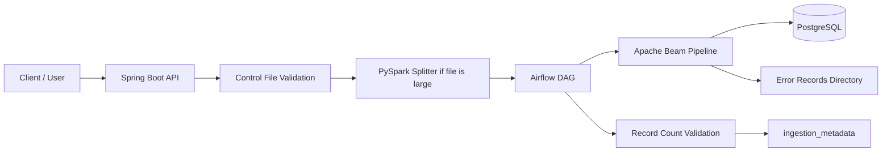

# Architecture Overview

This project implements a controlled ingestion workflow for CSV and JSON data files. It is designed around a clear separation of concerns:

- API receives and validates the request
- orchestration layer triggers and monitors the pipeline
- processing layer transforms and loads data
- data store persists warehouse and metadata records

## High-Level Flow

## Components

### 1. Service API

The API entry point is `service-api` and is built with Spring Boot 3 / Java 17.

Responsibilities:

- accept ingestion requests
- read control file metadata
- validate source path and expected row count
- split large datasets through PySpark if needed
- trigger Airflow with execution metadata
- expose warehouse data for read-only query

### 2. Airflow DAG

The DAG is defined in `airflow/dags/ingestion_dag.py`.

It manages:

- metadata entry `RUNNING`
- execution of the Java Beam jar
- record-count validation after load
- final metadata update as `COMPLETED` or `FAILED`

This is the coordination layer between the HTTP API and the data processing job.

### 3. Beam Processing Pipeline

The actual data transformation and database write logic is in `beam-pipeline`.

Responsibilities:

- read CSV or JSON input
- cleanse each record
- route invalid rows to error output files
- insert successful rows into `target_warehouse`
- preserve raw JSON payload and metadata fields for auditing

### 4. PostgreSQL

The warehouse is in PostgreSQL and is initialized by `database/init.sql`.

Tables:

- `target_warehouse`: final, structured records for analytics/reporting
- `ingestion_metadata`: one row per execution with status and counts

## Execution Lifecycle

1. Request is received by the API.
2. A UUID-based `execution_id` is created.
3. The control file is validated and parsed.
4. The input file is checked against a threshold.
5. If oversized, it is split into smaller chunks using PySpark.
6. Airflow triggers the Beam job for each file or chunk.
7. Beam writes success rows into PostgreSQL and failure rows to the error log folder.
8. Airflow compares the inserted row count against `expected_record_count`.
9. Metadata is updated to show the final result.

## Design Notes

- The system favors explicit execution metadata and auditability.
- Every ingestion run gets a unique `execution_id`.
- Validation is enforced at both the API and orchestration layers.
- Failed rows are preserved outside the main warehouse table for troubleshooting.
